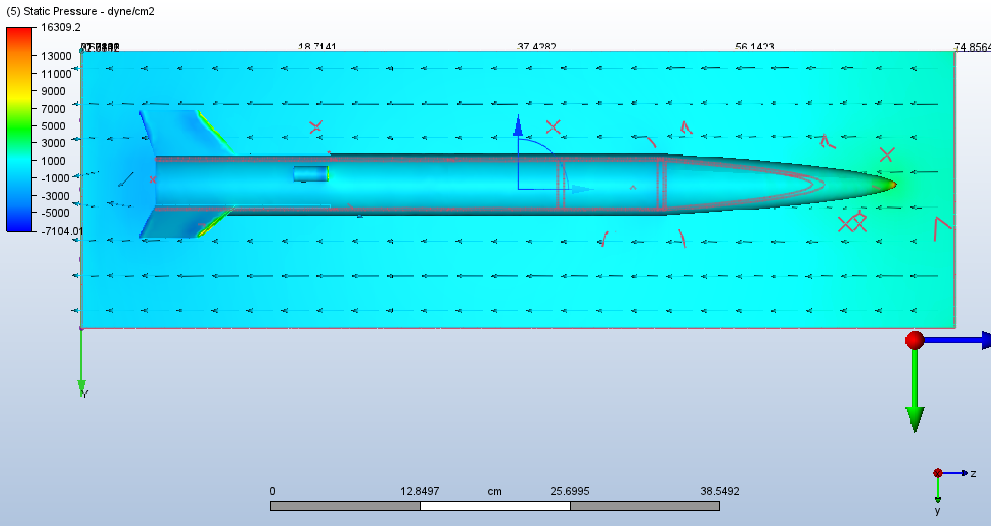
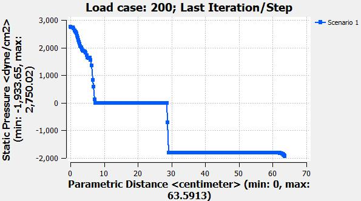

# Airframev1-CFD

This is the repository for computational fluid dynamics for our airframe N1 rocket


   

## Table of contents

* [General info](#general-info)
* [Technologies](#technologies)
* [Setup](#setup)
* [More information](#information)

## General info

This project is where our CFD files for the nakuja N1 rocket are placed. I did computational fluid dynamics on the N1 model using [`Autodesk CFD 2020`](https://www.autodesk.com/products/cfd/overview).

## Technologies

Project is created with:

* Autodesk CFD 2020
* VScode for documentaion purposes

## Setup

To run this project, install it locally using Inventor:

```bash

$ git clone https://github.com/nakujaproject/airframev1-CFD
$ cd airframev1-CFD
# Open Autodesk CFD 2020 and open the design files

```

* **Fusion files** This is the parent directory for all files.

* **Components of fusion files** These files here are the design files after exporting from Inventor using pack and go feature.

* **cfstudy** This directory has the solve files after solving the fluid dynamics equation. The solver, mesh and logs are found here

* **demo** This is the directory to open when using Autodesk CFD to try to run this siluation

## Information

For more information check out detailed process at [here](https://github.com/nakujaproject/rodneyResearch/blob/main/Airframe/03cfd.md)

### Our analysis looked like this



### Our velocity versus pressure graph


